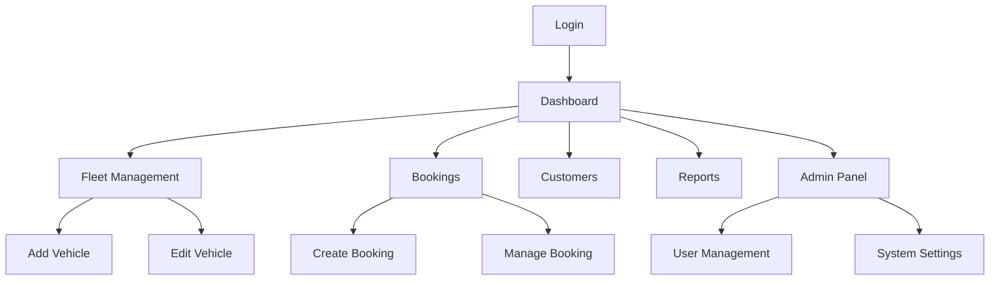
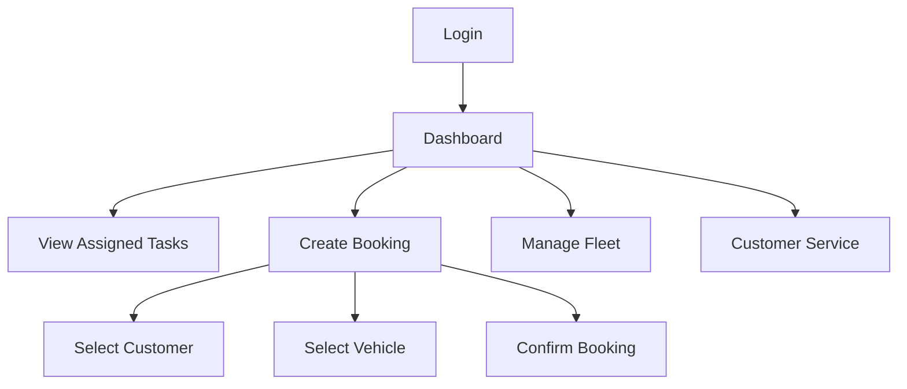

## 1. Product Overview

DriveSmart is a professional car rental management platform designed for internal use by car rental company owners and their employees. The platform requires a complete UI/UX refactor to transform it from a dashboard-style interface into a modern, app-like experience while maintaining professional standards and using the exact 5-color palette specified.

The refactor focuses on creating a mobile-first, responsive design that works seamlessly across all devices, with emphasis on clean aesthetics, intuitive interactions, and professional polish suitable for internal business operations.

## 2. Core Features

### 2.1 User Roles

| Role          | Registration Method          | Core Permissions                                     |
| ------------- | ---------------------------- | ---------------------------------------------------- |
| Admin         | System administrator account | Full system access, user management, system settings |
| Fleet Manager | Admin-created account        | Fleet management, booking oversight, reports access  |
| Booking Agent | Admin-created account        | Create/manage bookings, customer service             |
| Driver        | Admin-created account        | Vehicle assignment, trip logging                     |

### 2.2 Feature Module

The DriveSmart platform consists of the following main pages:

1. **Dashboard**: Overview with stats cards, recent activity, quick actions
2. **Fleet Management**: Vehicle listing, search, add/edit vehicles, availability tracking
3. **Bookings**: Booking list, new booking creation, booking details, confirmation
4. **Customers**: Customer list, customer details, booking history
5. **Reports**: Analytics dashboard, booking reports, revenue tracking
6. **User Profile**: Personal settings, activity history, preferences
7. **Admin Panel**: User management, system settings, data management

### 2.3 Page Details

| Page Name        | Module Name          | Feature description                                                                              |
| ---------------- | -------------------- | ------------------------------------------------------------------------------------------------ |
| Dashboard        | Stats Cards          | Display key metrics (active bookings, available cars, revenue, customers) with real-time updates |
| Dashboard        | Activity Feed        | Show recent bookings, vehicle returns, and system notifications                                  |
| Dashboard        | Quick Actions        | Provide shortcuts to common tasks (add booking, add vehicle, view reports)                       |
| Fleet Management | Vehicle Grid         | Display vehicles in card/list format with images, status, and key details                        |
| Fleet Management | Search & Filter      | Allow filtering by vehicle type, availability, location, and status                              |
| Fleet Management | Add Vehicle          | Multi-step form for adding new vehicles with validation                                          |
| Fleet Management | Vehicle Details      | Show comprehensive vehicle information, booking history, and maintenance records                 |
| Bookings         | Booking List         | Table view of all bookings with status indicators and quick actions                              |
| Bookings         | New Booking          | Step-by-step booking creation with customer selection and vehicle assignment                     |
| Bookings         | Booking Confirmation | Display booking summary with confirmation details and next steps                                 |
| Customers        | Customer List        | Searchable list of customers with contact information and booking history                        |
| Customers        | Customer Details     | Individual customer profile with booking history and preferences                                 |
| Reports          | Analytics Dashboard  | Charts and graphs showing booking trends, revenue, and utilization                               |
| Reports          | Booking Reports      | Detailed booking reports with export functionality                                               |
| User Profile     | Profile Settings     | Edit personal information, password, and preferences                                             |
| User Profile     | Activity History     | View personal activity log and booking history                                                   |
| Admin Panel      | User Management      | Create, edit, and deactivate user accounts                                                       |
| Admin Panel      | System Settings      | Configure system parameters and business rules                                                   |

## 3. Core Process

### Admin Flow



### Employee Flow



## 4. User Interface Design

### 4.1 Design Style

**Color Palette (Exact HEX Codes):**

* Light Lavender: #A7A5C6 (primary background/soft elements)

* Slate Blue: #8797B2 (secondary/headers)

* Steel Teal: #6D8A96 (accent/buttons)

* Dark Slate: #5D707F (text/dark elements)

* Bright Cyan: #66CED6 (CTA/active states)

**Typography:**

* Primary Font: Inter (body text, UI elements)

* Secondary Font: Poppins (headings, titles)

* Font Sizes: Responsive scaling from 14px (mobile) to 18px (desktop)

**Component Styles:**

* Buttons: Rounded corners (8px), minimum 44px height for touch

* Cards: Subtle shadows, 12px border radius, hover effects

* Forms: Floating labels, inline validation, error states in #66CED6

* Tables: Striped rows with #A7A5C6 background, sortable headers

* Modals: Centered with backdrop blur using #8797B2 with opacity

**Animations:**

* Hover transitions: 0.3s ease

* Page transitions: 0.5s fade/slide

* Loading animations: 1s pulse/spin

* Micro-interactions: Button press, card hover, notification badges

### 4.2 Page Design Overview

| Page Name        | Module Name      | UI Elements                                                                       |
| ---------------- | ---------------- | --------------------------------------------------------------------------------- |
| Dashboard        | Stats Cards      | Grid layout with gradient backgrounds, animated number counters, icon integration |
| Dashboard        | Activity Feed    | Timeline-style list with avatar images, status indicators, time stamps            |
| Fleet Management | Vehicle Grid     | Card-based layout with vehicle images, availability badges, action buttons        |
| Bookings         | Booking List     | Responsive table with status pills, quick action dropdowns, pagination            |
| User Profile     | Profile Settings | Form sections with tabs, avatar upload, preference toggles                        |
| Admin Panel      | User Management  | Data table with search, filters, bulk actions, user status indicators             |

### 4.3 Responsiveness

**Mobile-First Design:**

* Mobile: < 768px (primary design target)

* Tablet: 768px - 1024px

* Desktop: > 1024px

**Mobile Requirements:**

* Hamburger menu with smooth slide animation

* Touch-friendly buttons (minimum 44×44px)

* Bottom navigation bar for primary actions

* Swipe gestures for car image galleries

* Optimized forms with appropriate input types

* No horizontal scrolling on any device

### 4.4 Accessibility

* ARIA labels for all interactive elements

* Keyboard navigation support

* Screen reader compatibility

* High contrast mode support

* Focus indicators with #66CED6 outline

* Semantic HTML5 structure

* Alt text for all images

## 5. Technical Implementation Notes

**File Structure:**

```
css/
├── main.css          # Base styles, CSS variables
├── components.css    # All UI components
├── layout.css        # Grid, flex, responsive utilities
├── animations.css    # All animations and transitions
└── themes.css        # Light/dark mode variations

js/
├── main.js          # Core functionality
├── ui.js            # UI interactions and animations
└── api.js           # API calls and data handling
```

**Performance Requirements:**

* Optimized images with lazy loading

* Minimal CSS/JS bundles

* Efficient animations using CSS transforms

* Progressive enhancement approach

* Offline capability for critical functions

**Browser Compatibility:**

* Chrome, Firefox, Safari, Edge (latest 2 versions)

* Progressive enhancement for older browsers

* Polyfills for modern JavaScript features

* Fallback fonts for typography

**SEO Optimization:**

* Semantic HTML5 structure

* Meta tags for social sharing

* Structured data for business information

* XML sitemap generation

* Open Graph tags

